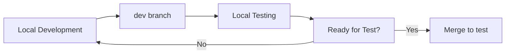
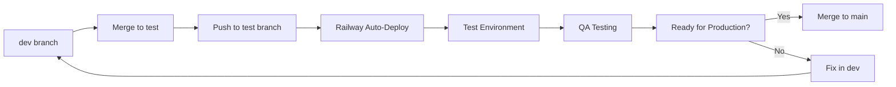
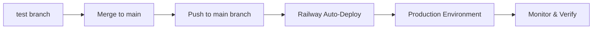

# Environment Management Plan
## GitHub Branch-Based Deployment Strategy

### Overview
This document outlines a comprehensive environment management strategy using GitHub branches to control deployments across three environments: Development, Test, and Production. All deployments are triggered by pushes to specific branches, with Railway handling the Test and Production environments.

---

## 🏗️ Architecture Overview

### Branch Structure
```
main (production)     → Railway Production Environment
├── test             → Railway Test Environment  
└── dev              → Local Development Environment
```

### Environment Mapping
| Environment | Branch | Deployment Trigger | Platform | URL |
|-------------|--------|-------------------|----------|-----|
| **Development** | `dev` | Manual `npm start` | Local | `http://localhost:3000` |
| **Test** | `test` | Push to `test` branch | Railway | `https://thanksgiving-test-production.up.railway.app` |
| **Production** | `main` | Push to `main` branch | Railway | `https://thanksgiving-prod-production.up.railway.app` |

---

## 🔄 Deployment Workflow

### 1. Development Workflow


### 2. Test Environment Workflow


### 3. Production Environment Workflow


---

## 📋 Implementation Plan

### Phase 1: Branch Setup and Configuration (Estimated: 2-3 hours)

#### Task 1.1: Create Branch Structure ⚡ **ASSIGNED TO: AI Assistant**
- [ ] Create `test` branch from current `main`
- [ ] Create `dev` branch from current `main`
- [ ] Set up branch protection rules for `main` and `test`
- [ ] Configure branch naming conventions
- [ ] Document branch policies

#### Task 1.2: Railway Environment Configuration ⚡ **ASSIGNED TO: User**
- [ ] Create separate Railway projects for test and production
- [ ] Configure environment variables for each Railway project
- [ ] Set up Railway GitHub integration
- [ ] Configure auto-deploy triggers for `test` and `main` branches
- [ ] Test Railway deployment pipeline

#### Task 1.3: GitHub Actions Setup ⚡ **ASSIGNED TO: AI Assistant**
- [ ] Create `.github/workflows/deploy-test.yml`
- [ ] Create `.github/workflows/deploy-production.yml`
- [ ] Configure Railway deployment actions
- [ ] Set up environment-specific secrets
- [ ] Add deployment status checks

### Phase 2: Environment-Specific Configuration (Estimated: 3-4 hours)

#### Task 2.1: Environment Variables Management ⚡ **ASSIGNED TO: AI Assistant**
- [ ] Create environment-specific `.env` files
- [ ] Update configuration management for multi-environment
- [ ] Implement environment detection logic
- [ ] Document environment variable requirements
- [ ] Create environment validation scripts

#### Task 2.2: Database Configuration ⚡ **ASSIGNED TO: User**
- [ ] Set up separate databases for test and production
- [ ] Configure Railway PostgreSQL for each environment
- [ ] Create database migration scripts
- [ ] Set up database seeding for test environment
- [ ] Document database connection strings

#### Task 2.3: Feature Flags and Environment Detection ⚡ **ASSIGNED TO: AI Assistant**
- [ ] Implement environment detection in application
- [ ] Create feature flag system
- [ ] Add environment-specific logging
- [ ] Configure different log levels per environment
- [ ] Implement environment-specific error handling

### Phase 3: Deployment Automation (Estimated: 2-3 hours)

#### Task 3.1: Automated Testing Pipeline ⚡ **ASSIGNED TO: AI Assistant**
- [ ] Create pre-deployment test suite
- [ ] Configure automated testing for each environment
- [ ] Set up smoke tests for test and production
- [ ] Implement deployment health checks
- [ ] Create rollback procedures

#### Task 3.2: Monitoring and Alerting ⚡ **ASSIGNED TO: User**
- [ ] Set up Railway monitoring for both environments
- [ ] Configure deployment notifications
- [ ] Create health check endpoints
- [ ] Set up error tracking and alerting
- [ ] Document monitoring procedures

#### Task 3.3: Documentation and Training ⚡ **ASSIGNED TO: AI Assistant**
- [ ] Update README with deployment procedures
- [ ] Create deployment runbook
- [ ] Document troubleshooting procedures
- [ ] Create environment management guide
- [ ] Document rollback procedures

### Phase 4: Testing and Validation (Estimated: 2-3 hours)

#### Task 4.1: End-to-End Testing ⚡ **ASSIGNED TO: AI Assistant**
- [ ] Test complete deployment pipeline
- [ ] Validate environment isolation
- [ ] Test rollback procedures
- [ ] Verify monitoring and alerting
- [ ] Create deployment validation checklist

#### Task 4.2: Performance and Security Testing ⚡ **ASSIGNED TO: User**
- [ ] Test production environment performance
- [ ] Validate security configurations
- [ ] Test database migrations
- [ ] Verify backup and recovery procedures
- [ ] Conduct load testing

---

## 🛠️ Technical Implementation Details

### Branch Protection Rules

#### Main Branch (Production)
```yaml
Protection Rules:
  - Require pull request reviews (2 reviewers)
  - Require status checks to pass
  - Require branches to be up to date
  - Restrict pushes to main branch
  - Require linear history
```

#### Test Branch
```yaml
Protection Rules:
  - Require pull request reviews (1 reviewer)
  - Require status checks to pass
  - Allow force pushes (for hotfixes)
```

### GitHub Actions Workflows

#### Test Environment Deployment
```yaml
# .github/workflows/deploy-test.yml
name: Deploy to Test Environment
on:
  push:
    branches: [test]
  workflow_dispatch:

jobs:
  deploy-test:
    runs-on: ubuntu-latest
    steps:
      - uses: actions/checkout@v3
      - name: Deploy to Railway Test
        uses: railway-app/railway-deploy@v1
        with:
          railway-token: ${{ secrets.RAILWAY_TEST_TOKEN }}
          service: thanksgiving-test
```

#### Production Environment Deployment
```yaml
# .github/workflows/deploy-production.yml
name: Deploy to Production Environment
on:
  push:
    branches: [main]
  workflow_dispatch:

jobs:
  deploy-production:
    runs-on: ubuntu-latest
    steps:
      - uses: actions/checkout@v3
      - name: Deploy to Railway Production
        uses: railway-app/railway-deploy@v1
        with:
          railway-token: ${{ secrets.RAILWAY_PROD_TOKEN }}
          service: thanksgiving-prod
```

### Environment Configuration

#### Environment Detection
```typescript
// src/lib/environment.ts
export const getEnvironment = (): 'development' | 'test' | 'production' => {
  const nodeEnv = process.env['NODE_ENV'];
  const railwayEnv = process.env['RAILWAY_ENVIRONMENT'];
  
  if (nodeEnv === 'development') return 'development';
  if (railwayEnv === 'production') return 'production';
  if (railwayEnv === 'test' || nodeEnv === 'test') return 'test';
  
  return 'development';
};
```

#### Database Configuration
```typescript
// src/lib/database.ts
const getDatabaseUrl = (): string => {
  const env = getEnvironment();
  
  switch (env) {
    case 'development':
      return process.env['DATABASE_URL'] || 'postgresql://localhost:5432/thanksgiving_dev';
    case 'test':
      return process.env['RAILWAY_TEST_DATABASE_URL'];
    case 'production':
      return process.env['RAILWAY_PROD_DATABASE_URL'];
    default:
      throw new Error(`Unknown environment: ${env}`);
  }
};
```

---

## 📊 Monitoring and Observability

### Health Checks
- **Development**: Manual testing and local monitoring
- **Test**: Automated smoke tests + manual QA
- **Production**: Continuous monitoring + alerting

### Key Metrics
- Deployment success rate
- Application uptime
- Response times
- Error rates
- Database performance

### Alerting Thresholds
- **Critical**: Application down, database connection failed
- **Warning**: High error rate (>5%), slow response times (>2s)
- **Info**: Successful deployments, performance metrics

---

## 🔒 Security Considerations

### Environment Isolation
- Separate databases for each environment
- Different API keys and secrets
- Isolated Railway projects
- Environment-specific CORS settings

### Access Control
- Production deployments require approval
- Test environment allows faster iteration
- Development environment has full access
- Audit logs for all deployments

---

## 📚 Documentation Requirements

### Required Documentation
1. **Environment Management Guide** - Complete setup and usage
2. **Deployment Runbook** - Step-by-step deployment procedures
3. **Troubleshooting Guide** - Common issues and solutions
4. **Rollback Procedures** - How to revert deployments
5. **Monitoring Guide** - How to monitor and alert

### Documentation Maintenance
- Update documentation with each major change
- Review documentation quarterly
- Keep deployment procedures current
- Maintain troubleshooting knowledge base

---

## 🚀 Success Criteria

### Phase 1 Success
- [ ] All branches created and protected
- [ ] Railway environments configured
- [ ] GitHub Actions workflows functional

### Phase 2 Success
- [ ] Environment-specific configurations working
- [ ] Database isolation complete
- [ ] Feature flags implemented

### Phase 3 Success
- [ ] Automated deployments working
- [ ] Monitoring and alerting active
- [ ] Documentation complete

### Phase 4 Success
- [ ] End-to-end testing passed
- [ ] Performance requirements met
- [ ] Security validation complete

---

## 📅 Timeline

| Phase | Duration | Start Date | End Date | Dependencies |
|-------|----------|------------|----------|--------------|
| Phase 1 | 2-3 hours | TBD | TBD | None |
| Phase 2 | 3-4 hours | TBD | TBD | Phase 1 complete |
| Phase 3 | 2-3 hours | TBD | TBD | Phase 2 complete |
| Phase 4 | 2-3 hours | TBD | TBD | Phase 3 complete |

**Total Estimated Time**: 9-13 hours

---

## 🎯 Next Steps

1. **Review and Approve Plan** - User reviews this plan and provides feedback
2. **Assign Resources** - Confirm availability for implementation
3. **Begin Phase 1** - Start with branch setup and Railway configuration
4. **Iterate and Improve** - Refine the process based on experience

---

## 📞 Support and Escalation

### Level 1: Self-Service
- Documentation and troubleshooting guides
- Automated deployment procedures
- Basic monitoring and alerting

### Level 2: Technical Support
- GitHub Actions issues
- Railway deployment problems
- Environment configuration issues

### Level 3: Emergency Escalation
- Production outages
- Security incidents
- Critical deployment failures

---

*This document will be updated as the implementation progresses and lessons are learned.*
